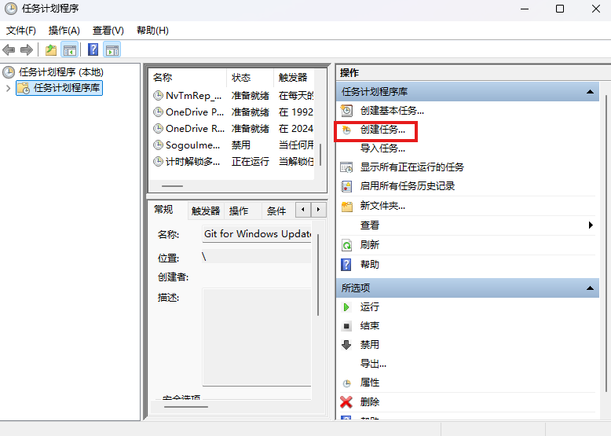
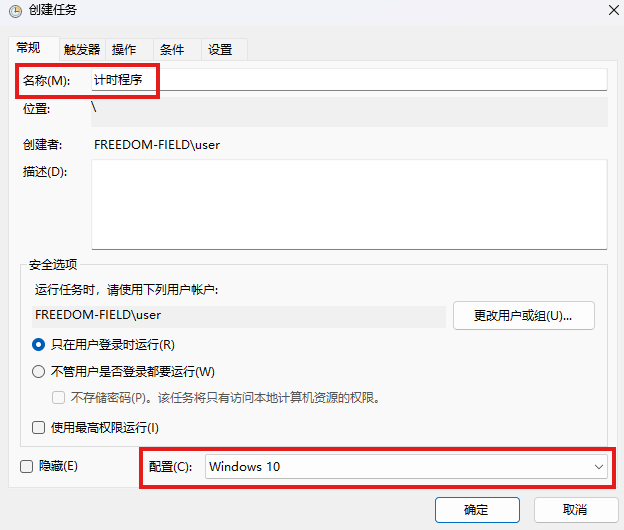
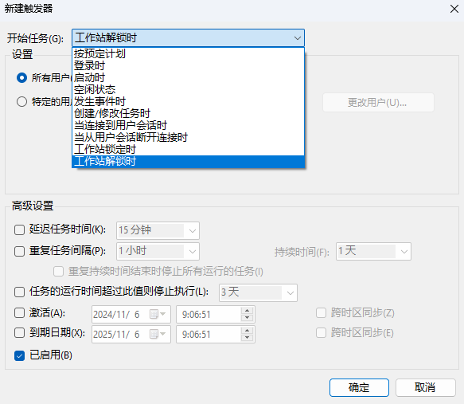
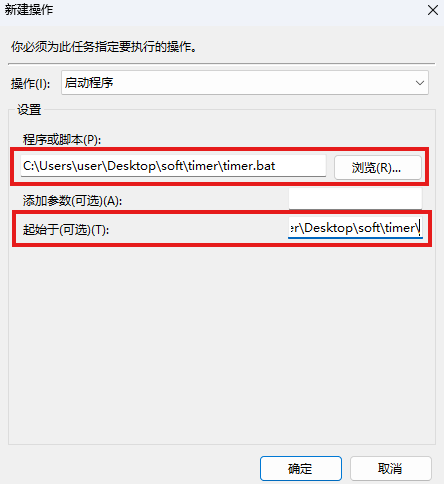
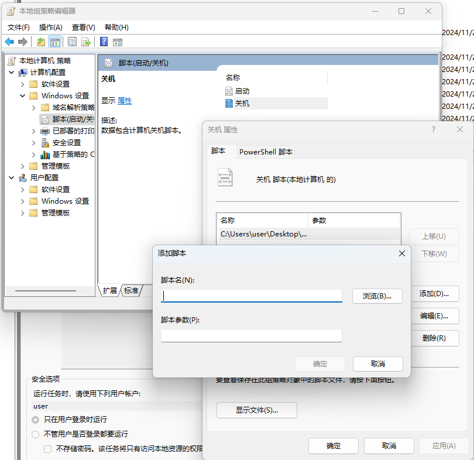

# 简介

## 解锁时启动计时脚本

系统右下搜索：任务计划程序  

选【创建任务】  

输入任务名称、配置Window 10  

触发器：新建--选择【工作站解锁时】  

新建--浏览-选中要启动的程序或脚本  

起始于：父文件夹  

## 锁定屏幕时运行停止计时脚本  

方法同上

## 关机时运行停止计时脚本  

任务计划程序没有关机动作，可以在关机属性里面添加bat脚本  

